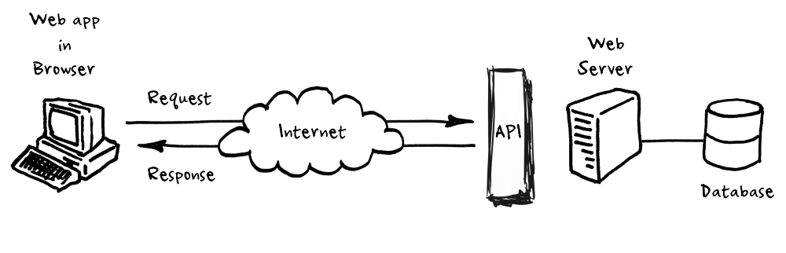

# Hacker News API Guide


>**Disclaimer** <br> This is an unofficial guide to the HackerNews API. The author is not affiliated with HN in any official function.

## Getting Started

This tutorial is meant as a quick step-by-step guide to get started using the [HN API](https://github.com/HackerNews/API) whilst also teaching some fundamental things about APIs and introducing useful tools for testing APIs. This tutorial is mainly geared towards junior developers.

## Hacker News

[Hacker News](https://news.ycombinator.com/) is a social news website focusing on computer science and entrepreneurship. It follows the "anything that gratifies one's intellectual curiosity" slogan. If you haven't been on Hacker News before, feel free to pause this guide and stop by to get a feel of what we're going to work with. (Source: [Wiki](https://en.wikipedia.org/wiki/Hacker_News))

### Types of Content

Content posted on Hacker News can be put into one of the following categories:

- Stories
- Jobs
- Comments
- Ask Hacker News

We will learn how to get the content using a

## Precourse on what APIs are
- Disclaimer (You can skip this if you have worked with APIs before)
- You talk with web APIs using HTTP clients. The windows command-line comes with curl built-in, but most popular programming languages have plug-and-play HTTP client libraries.
- Explain in quick sentences what APIs generally are
- Now a quick intro to Web APIs and the Restful paradigm

>**NOTE** <br> If you know what APIs are and have worked with APIs in the web context, you can skip this part.

API stands for `Application Programming Interface`. Just by digesting the words of the acronym we can derive, that:
- Something communicates with something else(`Interface`)
- The context lies in the domain of software development(`application`)
- We write code in order to use APIs(`Programming`)

An API is an abstraction layer between some part of software and some other part of software, simplifying interaction between the two.

### Minimal example of an API

One common type of API are libraries. You use libraries to abstract complexity away from complicated things, for example `dates`, or handling `User I/O` or more high-level things such as Data Science ([pandas](https://pandas.pydata.org/)), utility libraries([libavutil](https://ffmpeg.org/libavutil.html)) or even a library for [speech recognition](https://pypi.org/project/SpeechRecognition/).

```python

#import library
import speech_recognition as sr

# Initialize recognizer class (for recognizing the speech)
r = sr.Recognizer()

# Reading Audio file as source
# listening the audio file and store in audio_text variable

with sr.AudioFile('I-dont-know.wav') as source:
    
    audio_text = r.listen(source)
    
# recoginize_() method will throw a request error if the API is unreachable, hence using exception handling
    try:
        
        # using google speech recognition
        text = r.recognize_google(audio_text)
        print('Converting audio transcripts into text ...')
        print(text)
     
    except:
         print('Sorry.. run again...')

```

The example above is written in Python but the principle of abstraction applies to any library. So, libraries are one kind of API, what else is out there? Glad you asked...

### Web based APIs


[Source](https://medium.com/@perrysetgo/what-exactly-is-an-api-69f36968a41f)

Since the world wide web has started to conquer the world since its modest beginning in March 12th, 1989 when Tim [Berners-Lee](https://en.wikipedia.org/wiki/Tim_Berners-Lee) submitted his memorandum titled "Information Management: A Proposal" to the management at CERN.

Web APIs are responsible for transferring data from the server to the client. Several protocols have been developed for that kind of communication today known as [HTTP](https://en.wikipedia.org/wiki/Hypertext_Transfer_Protocol) (Hypertext Transfer Protocol).

### A Short Experiment

Visit following URL with your web browser:

`https://api.github.com/users/Zenahr/repos`

If you're using Firefox as your web browser, it should look something like this:


The web browser has hit an API endpoint and represents the structured data (JSON) for us.

#### What just happened?

We made an _HTTP request_ to the _repos_ endpoint of the _GitHub API_ and got a bunch of JSON objects back as a _response_. JSON is one common way of transportation via the web. JSON stands for `Javascript Object Notation`. I won't go through the details of it here The only thing we need to be aware of is that the data we get back is structured data and the container used to structure the data is JSON. Read more about JSON and its intricacies [here](https://www.json.org/json-en.html). It's worth it if you're planning on working in web-development regardless of wether you specialise in front-end or back-end development.

### Choosing an HTTP Client

We need a meaningful way of representing data received from API endpoints. This is where HTTP clients come into play. Remember, APIs use the HTTP protocol for transportation.

If you'd like to very quickly test something out you could always use [curl](https://curl.haxx.se/).

open your terminal(Linux) or command-line(Windows) and enter the following line of code:

`https://api.github.com/users/Zenahr/repos`

Yes, it's the same HTTP request we sent before, but this time we used our terminal/command-line to receive the payload. Payload is the actual content of the HTTP response without accounting for metadata and other things that go along with an HTTP response. In other words: If everything is working fine you usually only care and work with the payload of HTTP responses.

We will use Postman as our HTTP client because it has been specifically built for developing, testing and documenting APIs.

Feel free to [download Postman](https://www.postman.com/) and make yourself comfortable with it. It's free and open-source.

## Exploring the API

- Intro to the API (open/closed?) (not restful)
- The API is a collection of HTTP RPC-style methods using following URL building principle:
`https://hacker-news.firebaseio.com/v0/METHOD_FAMILY.method`
example:
`https://hacker-news.firebaseio.com/v0/beststories.json`

>For anyone interested in reading more about the differences between REST and RPC I recommend [this article](https://www.smashingmagazine.com/2016/09/understanding-rest-and-rpc-for-http-apis/) by Phil Sturgeon.


### Methods
- Introductory text explaining where and how I obtained the table
- Table of endpoints itself

The current API does not follow the Restful paradigm. Everything is an item. There are no semantic endpoints such as `api/stories`,  or `api/jobs` except `api/users`. The only way to only get one type of item is by using the following 

|Method|Description|Endpoint|
|---|---|---|
|`beststories.json`|||
|`maxitem.json`|get item with currently largest id|https://hacker-news.firebaseio.com/v0/maxitem.json?print=pretty|
|`topstories.json`|Get 500 top stories|https://hacker-news.firebaseio.com/v0/topstories.json?print=pretty|
|`newstories.json`|Get 500 latest stories (Also contains jobs)|https://hacker-news.firebaseio.com/v0/newstories.json?print=pretty|
|`beststories.json`|Get 500 best voted stories sorted by votes in descending order|https://hacker-news.firebaseio.com/v0/beststories.json|
|`askstories.json`|Get latest Ask Stories|https://hacker-news.firebaseio.com/v0/askstories.json?print=pretty|
|`showstories.json`|Get latest Show Stories|https://hacker-news.firebaseio.com/v0/showstories.json?print=pretty|
|`jobstories.json`|Get latest Job Stories|https://hacker-news.firebaseio.com/v0/jobstories.json?print=pretty|
|`updates.json`|Get latest items that have been updated (including profiles)|https://hacker-news.firebaseio.com/v0/updates.json?print=pretty|

## Example Scenario

- Explain what we want to do
- Show results of using 
https://hacker-news.firebaseio.com/v0/beststories.json?print=pretty
- explain API parameters (beststories is a an object and we use . notation here to access the objects json property)

## Integration example (webapp architecture and use-case)

## Limitations

The current API is limited in its functionality. It supports only ¼ of standard `CRUD` API functionality. This means one can't Create(`C`), Update(`U`) or Delete(`C`) but only Read(`R`) database entries. It also does not support [pagination](https://developer.atlassian.com/server/confluence/pagination-in-the-rest-api/).

## Outro

I have created this repo and a public Postman Docs site containing everything we went through in case you'd like to use this as a resource for further learning or to build the next Hacker News Reader App.